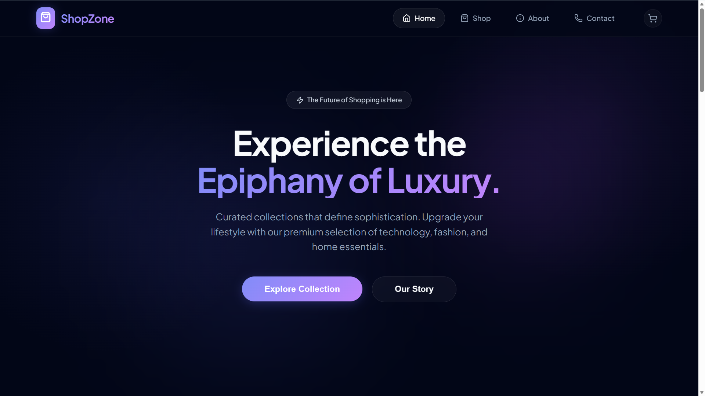
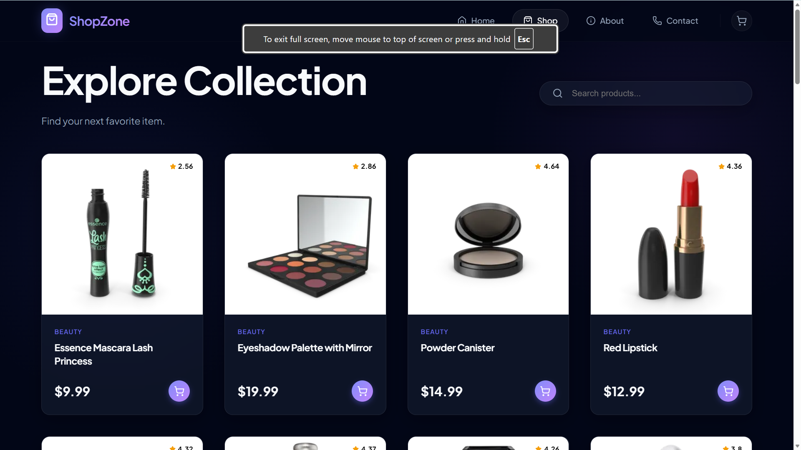
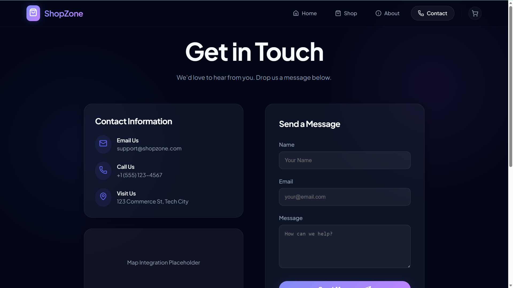

# 🛍️ Shop Zone — Premium E-Commerce Platform

A modern, full-featured e-commerce web application built with **React + Vite**, featuring a premium dark aesthetic with glassmorphism effects, smooth animations, and a fully functional shopping cart.

🔗 **Live Demo:** [Shop Zone on Vercel](https://shop-zone-ys.vercel.app/)

---

## 📸 Screenshot

<p align="center">
  
  
  
</p>

---

## ✨ Features

- 🏠 **Home Page** — Hero section, curated categories, new arrivals, and trust signals
- 🛒 **Shop Page** — Browse all products with search and category filtering
- 📄 **Product Details** — Full product view with image, rating, description, and add-to-cart
- 🛍️ **Cart** — Persistent cart with quantity controls, subtotal, and checkout UI
- 📞 **Contact Page** — Styled contact form with store info
- ℹ️ **About Us** — Brand story and values section
- 🎨 **Premium UI** — Glassmorphism, gradient backgrounds, and Framer Motion animations
- 🔔 **Toast Notifications** — Real-time feedback on cart actions via React Hot Toast

---

## 🛠️ Tech Stack

| Technology                                     | Purpose                  |
| ---------------------------------------------- | ------------------------ |
| [React 19](https://react.dev)                  | UI Library               |
| [Vite 7](https://vite.dev)                     | Build Tool & Dev Server  |
| [React Router DOM v7](https://reactrouter.com) | Client-side Routing      |
| [Framer Motion](https://www.framer.com/motion) | Animations & Transitions |
| [Lucide React](https://lucide.dev)             | Icon Library             |
| [React Hot Toast](https://react-hot-toast.com) | Toast Notifications      |
| [DummyJSON API](https://dummyjson.com)         | Product Data Source      |

---

## 📁 Project Structure

```
shop/
├── public/
├── src/
│   ├── assets/          # Static assets
│   ├── components/
│   │   ├── Navbar.jsx       # Top navigation bar with cart indicator
│   │   ├── Footer.jsx       # Global footer with links & newsletter
│   │   └── ProductCard.jsx  # Reusable product card component
│   ├── context/
│   │   └── CartContext.jsx  # Global cart state (React Context)
│   ├── pages/
│   │   ├── Home.jsx         # Landing page
│   │   ├── Shop.jsx         # Product listing with filters
│   │   ├── ProductDetails.jsx # Single product view
│   │   ├── Cart.jsx         # Shopping cart
│   │   ├── Contact.jsx      # Contact form
│   │   └── About.jsx        # About Us page
│   ├── App.jsx          # Root component with routing
│   ├── App.css          # Component-level styles
│   ├── index.css        # Global styles & CSS variables
│   └── main.jsx         # App entry point
├── index.html
├── package.json
└── vite.config.js
```

---

## 🚀 Getting Started

### Prerequisites

- **Node.js** v18+ and **npm** installed

### Installation

```bash
# 1. Clone the repository
git clone https://github.com/yashsoni1110/Shop_Zone.git

# 2. Navigate to the project folder
cd shop

# 3. Install dependencies
npm install

# 4. Start the development server
npm run dev
```

The app will be available at **http://localhost:5173**

---

## 📜 Available Scripts

| Command           | Description                          |
| ----------------- | ------------------------------------ |
| `npm run dev`     | Start development server with HMR    |
| `npm run build`   | Build for production                 |
| `npm run preview` | Preview the production build locally |
| `npm run lint`    | Run ESLint for code quality checks   |

---

## 🌐 API

Product data is fetched from the [DummyJSON API](https://dummyjson.com/products):

- **All Products:** `GET /products`
- **Single Product:** `GET /products/:id`
- **Search:** `GET /products/search?q={query}`
- **By Category:** `GET /products/category/{category}`

---

## 🎨 Design Highlights

- **Dark Theme** with deep slate backgrounds and indigo/purple gradient accents
- **Glassmorphism** cards using `backdrop-filter: blur` and translucent borders
- **Animated Backgrounds** with radial gradient blobs and pulse keyframes
- **Scroll-triggered Animations** via Framer Motion's `whileInView`
- **Responsive Grid Layouts** using CSS `auto-fit minmax` grid

---

## 📦 Deployment

```bash
# Build the production bundle
npm run build

# The output is in the /dist folder — deploy to any static host:
# Vercel, Netlify, GitHub Pages, etc.
```

---

## 👨‍💻 Author

**Yash Soni**

- GitHub: [@yashsoni1110](https://github.com/yashsoni1110)

---

> Built with ❤️ using React + Vite
